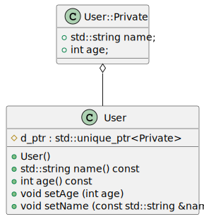

# pimp
pImpl Idiom in C++

[](https://github.com/epsilonrt/pimp/releases) 
[](https://registry.platformio.org/libraries/epsilonrt/pimp) 
[](https://www.arduinolibraries.info/libraries/pimp) 

[](https://github.com/epsilonrt/pimp/actions/workflows/build_desktop.yml)
[](https://github.com/epsilonrt/pimp/actions/workflows/build_arduino.yml)
[](https://github.com/epsilonrt/pimp/actions/workflows/unit_test.yml)


---

_The pImpl Idiom **(Pointer to IMPLementation)** is a technique used for separating implementation from the interface. It minimizes header exposure and helps programmers to reduce build dependencies by moving the private data members in a separate class and accessing them through an [opaque pointer](https://www.geeksforgeeks.org/opaque-pointer/)_.

This is a C++ programming technique that removes implementation details of a class from its object representation by    placing them in a separate class, accessed through an opaque pointer. This technique is used to construct C++ library interfaces with stable ABI and to reduce compile-time dependencies.

<!--  -->
<p align="center">
  
</p>

As can be seen in the diagram above, the **User** class has a single data member, **d_ptr** which is a pointer to the implementing class **User::Private**. The **User::Private** class is defined in the **user_p.h** file and is used only in the **user.cpp** file. The **User** class is defined in the **user.h** file and will constitute the API of the **User** class. The user of the **User** class does not need to know the definition of the **User::Private** class. It will use the public methods of the **User** class to access the private member data of the **User::Private** class (name() and setName() allow access to the private data **name** for example).

The **pimp lib** is very strongly inspired by the implementation of the [Qt](https://www.qt.io/) library which uses a **d** pointer to the private class (implemantation) and a **q** pointer to the public class (API). The explanations below are taken from the [D-Pointer](https://wiki.qt.io/D-Pointer) page of the Qt wiki. The explanations are in the context of the Qt library but they are also valid for the **pimp lib** and may be read to own [wiki page](https://github.com/epsilonrt/pimp/wiki/The-d%E2%80%90pointer) in the context of the **pimp lib**.

The **pimp lib** provide a [PimpClass](https://epsilonrt.github.io/pimp/class_pimp_class.html) that can be used as a base class for any class that needs to use the pImpl idiom. The private implementation class must be defined in the source file of the class that uses it or in a private header file (with _p suffix for example). [PimpClass::Private](https://epsilonrt.github.io/pimp/struct_pimp_class_1_1_private.html) is a friend of the class that uses it. Then, **pimp lib** provide a set of macros that can be used to hide the private implementation class and the private implementation pointer.

Thus, the complete example of the **User** class using the **pimp lib** is as follows:

**user.h**, the API of the **User** class:
```cpp
#include <pimp.h>

// User class is a PimpClass with a private implementation.
class User : public PimpClass {
  public:
    // Public API
    // ----------------------------------------
    // Default constructor
    User();
    // Constructor with parameters
    User (const std::string &name, int age);
    // Returns the name
    std::string name() const;
    // Returns the age
    int age() const;
    // Sets the age
    void setAge (int age);
    // Sets the name
    void setName (const std::string &name);

    // the part below will always be present in derived classes, 
    // it allows storing and accessing private member data with 
    // the d_ptr pointer of the base class using the PIMP_D() macro.
  protected:
    // Constructor with private implementation
    class Private;
    // This constructor must be used by derived classes
    User (Private &dd);
  private:
    // Declare d_func() macro for private implementation access
    PIMP_DECLARE_PRIVATE (User)
};
```

**user_p.h**, the private implementation class of the **User** class:
```cpp
#include <pimp_p.h>
#include "user.h"

// Private implementation of User class
// This class is not exported and is only used by User class
// It is derived from PimpClass::Private to allow access to the API class with PIMP_Q() macro
class User::Private : public PimpClass::Private {
  public:
    // Constructor call by User class for creating the private implementation
    Private (User *q);
    // Private attributes
    std::string name;
    int age;
    // Declare q_func() macro for API class access
    PIMP_DECLARE_PUBLIC (User)
};
```

**user.cpp**, the source file of the **User** class:
```cpp
#include "user_p.h"

// ----------------------------------------------------------------------------
// User class implementation
// ----------------------------------------------------------------------------

// Default constructor
// Call the protected constructor with private implementation
User::User() : PimpClass (*new Private (this)) {
}

// Protected constructor with private implementation
User::User (Private &dd) : PimpClass (dd) {
}

// Constructor with parameters
User::User (const std::string &name, int age) : User() {
  PIMP_D (User);
  d->name = name;
  d->age = age;
}
// ----------------------------------------------------------------------------
// Public API
// ----------------------------------------------------------------------------

// Returns the name
std::string User::name() const {
  PIMP_D (const User);
  return d->name;
}

// Returns the age
int User::age() const {
  PIMP_D (const User);
  return d->age;
}

// Sets the age
void User::setAge (int age) {
  PIMP_D (User);
  d->age = age;
}

// Sets the name
void User::setName (const std::string &name) {
  PIMP_D (User);
  d->name = name;
}

// ----------------------------------------------------------------------------
// User::Private implementation
// ----------------------------------------------------------------------------

// Constructor that is called by User class for creating the private implementation
// Initializes the private attributes
User::Private::Private (User *q) : PimpClass::Private (q), age (0) {}
```

That corresponds to the following diagram:

<p align="center">
  
</p>

> The **pimp lib** uses [std::unique_ptr](https://en.cppreference.com/w/cpp/memory/unique_ptr), thus, this library **can only be used on platforms with a STL implementation** (see the list below).

**List of platforms supported by pimp**

**Embedded**  
* [Atmel SAM](https://docs.platformio.org/en/stable/platforms/atmelsam.html#platform-atmelsam)  
* [Espressif 32](https://docs.platformio.org/en/stable/platforms/espressif32.html#platform-espressif32)  
* [Espressif 8266](https://docs.platformio.org/en/stable/platforms/espressif8266.html#platform-espressif8266)  
* [Heltec CubeCell](https://docs.platformio.org/en/stable/platforms/heltec-cubecell.html#platform-heltec-cubecell)  
* [Intel ARC32](https://docs.platformio.org/en/stable/platforms/intel_arc32.html#platform-intel-arc32)  
* [Nordic nRF52](https://docs.platformio.org/en/stable/platforms/nordicnrf52.html#platform-nordicnrf52)  
* [Raspberry Pi RP2040](https://docs.platformio.org/en/stable/platforms/raspberrypi.html#platform-raspberrypi)  
* [ST STM32](https://docs.platformio.org/en/stable/platforms/ststm32.html#platform-ststm32)  
* [Teensy](https://docs.platformio.org/en/stable/platforms/teensy.html#platform-teensy)  (not for AVR based Teensy)
* [TI TIVA](https://docs.platformio.org/en/stable/platforms/titiva.html#platform-titiva)

**Desktop**  
* [native](https://docs.platformio.org/en/stable/platforms/native.html)  (Windows, Linux, MacOS)  

